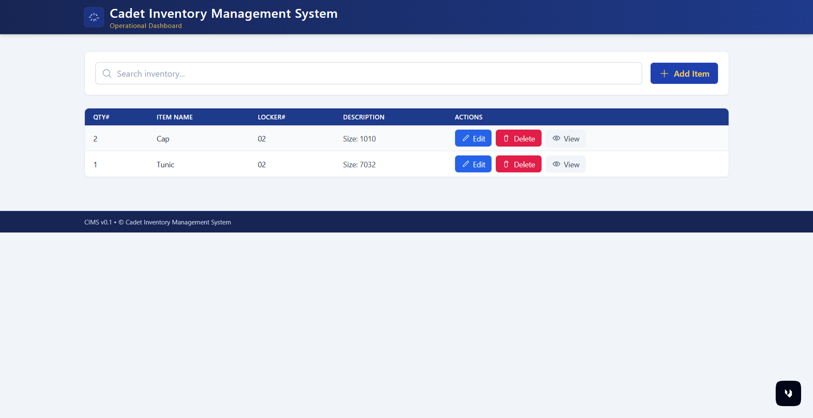

# Cadet Inventory Management System (CIMS)

Note: this is my first prototype for this CIMS project

**First Prototype**: Achieve a full CRUD web app without security, login, or a user base.

A full-stack inventory management system with Angular frontend and Spring Boot backend.




## 🎯 Features

- **CRUD Operations**: Create, Read, Update, and Delete inventory items
- **Search Functionality**: Real-time search across item names, locker numbers, and descriptions
- **RESTful API**: Clean backend architecture with Spring Boot
- **Naval-Themed UI**: Professional dashboard styled with Tailwind CSS
- **Responsive Design**: Works on desktop, tablet, and mobile devices

## 🏗️ Architecture

### Backend (Spring Boot)
- **Entity Layer**: JPA entities with Lombok
- **Repository Layer**: Spring Data JPA repositories
- **Service Layer**: Business logic and transaction management
- **Controller Layer**: REST API endpoints with proper CORS configuration
- **Database**: H2 in-memory database for development

### Frontend (Angular)
- **Components**: Modular standalone components
- **Services**: HTTP client services for API communication
- **Models**: TypeScript interfaces matching backend entities
- **Styling**: Tailwind CSS with naval theme

## 📋 Prerequisites

- Java 17 or higher
- Node.js 18+ and npm
- Gradle (or use the wrapper)

## 🚀 Getting Started

### Backend Setup

1. Navigate to the backend directory:
   ```powershell
   cd backend\CadetInventoryManagementSystem1
   ```

2. Build the project:
   ```powershell
   .\gradlew build
   ```

3. Run the Spring Boot application:
   ```powershell
   .\gradlew bootRun
   ```

   The backend will start on `http://localhost:8080`

4. (Optional) Access H2 Console:
   - URL: `http://localhost:8080/h2-console`
   - JDBC URL: `jdbc:h2:mem:cims_db`
   - Username: `sa`
   - Password: (leave empty)

### Frontend Setup

1. Navigate to the frontend directory:
   ```powershell
   cd frontend\cims-frontend
   ```

2. Install dependencies:
   ```powershell
   npm install
   ```

3. Start the Angular development server:
   ```powershell
   npm start
   ```

   The frontend will start on `http://localhost:4200`

## 📡 API Endpoints

| Method | Endpoint | Description |
|--------|----------|-------------|
| GET | `/api/items` | Get all items |
| GET | `/api/items/{id}` | Get item by ID |
| POST | `/api/items` | Create new item |
| PUT | `/api/items/{id}` | Update item |
| DELETE | `/api/items/{id}` | Delete item |
| GET | `/api/items/search?query={term}` | Search items |

## 🧪 Testing the Application

### 1. Start Backend
```powershell
cd C:\Dev\public_html\CadetInventoryManagementSystem1.0\backend\CadetInventoryManagementSystem1
.\gradlew bootRun
```

### 2. Start Frontend (in a new terminal)
```powershell
cd C:\Dev\public_html\CadetInventoryManagementSystem1.0\frontend\cims-frontend
npm start
```

### 3. Access the Application
Open your browser and navigate to `http://localhost:4200`

### 4. Test CRUD Operations
- **Add Item**: Click "Add Item" button, fill in the form, and submit
- **View Item**: Click the "View" button on any item row
- **Edit Item**: Click the "Edit" button, modify details, and save
- **Delete Item**: Click the "Delete" button and confirm
- **Search**: Type in the search box to filter items

## 🎨 Naval Theme Colors

- Primary Navy: `bg-blue-900`, `bg-slate-800`
- Accent Gold/Amber: `text-amber-300`, `focus:ring-amber-400`
- Steel Gray: `bg-slate-600`, `border-slate-600`
- White Contrast: `text-white`, `bg-white`

## 📁 Project Structure

```
CadetInventoryManagementSystem1.0/
├── backend/
│   └── CadetInventoryManagementSystem1/
│       └── src/main/java/com/example/CadetInventoryManagementSystem1/
│           ├── entity/           # JPA entities
│           ├── repository/       # Data repositories
│           ├── service/          # Business logic
│           ├── controller/       # REST controllers
│           └── exception/        # Custom exceptions
├── frontend/
│   └── cims-frontend/
│       └── src/app/
│           ├── components/       # Angular components
│           ├── services/         # HTTP services
│           └── models/           # TypeScript interfaces
└── README.md
```

## 🛠️ Technologies Used

### Backend
- Spring Boot 3.5.6
- Spring Data JPA
- H2 Database
- Lombok
- Java 17

### Frontend
- Angular 18+
- TypeScript
- Tailwind CSS
- RxJS

## 🔒 CORS Configuration

The backend is configured to allow requests from `http://localhost:4200`. Update `ItemController.java` if you deploy to a different origin.

## 📝 License

This project is for educational purposes.
